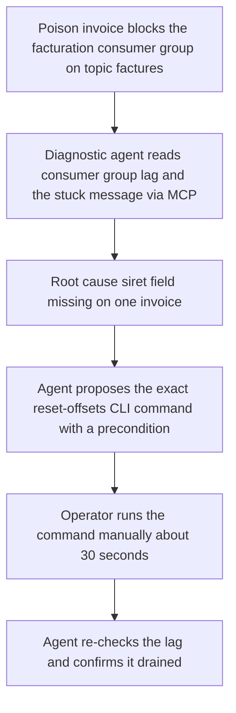
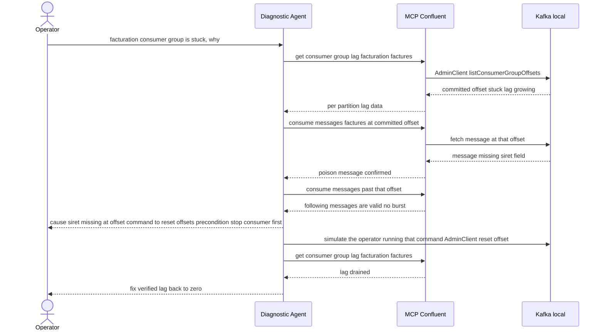
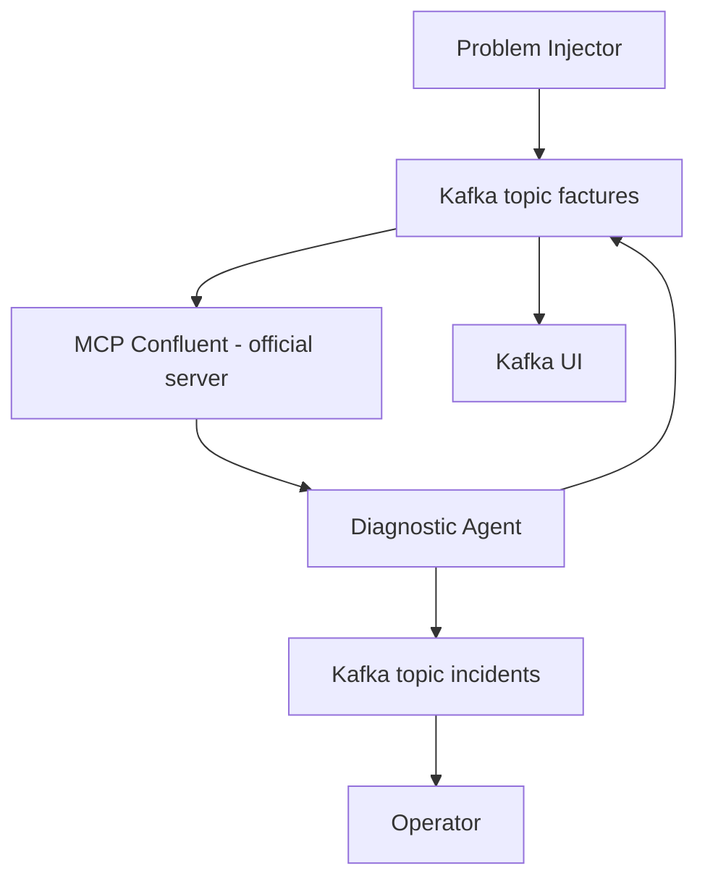

# Kafka Agentic Ops — Kafka Control Plane, Agent-Native

[](https://kafka.apache.org/)
[](https://www.python.org/)
[](https://pypi.org/project/google-adk/)
[](https://github.com/confluentinc/mcp-confluent)
[](https://docs.docker.com/compose/)

A proof-of-concept demonstrating an agent operating on the Kafka **control plane** — a single real [google-adk](https://pypi.org/project/google-adk/) agent that diagnoses a poison message blocking a consumer group, using the **official** [`@confluentinc/mcp-confluent`](https://github.com/confluentinc/mcp-confluent) server (read-only, real calls), proposes the exact CLI fix an operator would run — then closes the loop itself by verifying the lag actually drains once that fix lands.

> Article: [Quand un agent IA diagnostique votre Kafka — et vous laisse corriger](https://kafblog.dolizone.com/blog/kafka-agents-ops-loop/)

This is the second PoC in the series. The [first PoC](https://github.com/arabaaoui/kafka-for-agents) used Kafka as **coordination infrastructure** for business agents (retail replenishment). This one flips the target: Kafka is the **thing being operated on** — the agent diagnoses an incident on Kafka's own data plane. MCP is the interface for every read; there is no code generation and no message replay in this PoC. Companion article for PoC 1: [Kafka remplace vos middlewares — une supply chain de 200 magasins pilotée par 3 agents IA](https://kafblog.dolizone.com/blog/kafka-agents-supply-chain/).

---

## Use Case: A Poison Message Blocks Billing

An upstream producer bug drops the `siret` field from one invoice. The `facturation` consumer group reads it, crashes parsing the missing field, and disconnects **without committing** — so it refetches the exact same message on every restart. The committed offset freezes; the lag climbs with every new invoice behind it. Nobody notices until finance asks why billing stopped.

Manually, this is a 30–90 minute hunt across three dashboards: is it a broker issue, a network partition, a schema problem, a slow consumer? The diagnostic agent collapses that hunt to **2–3 minutes**: two real MCP calls pinpoint the exact offset and the exact message, and the actual fix — once you run the one command it hands you — takes **about 30 seconds**.

### Business Flow



### Functional Walkthrough



**Key facts:**
1. The `problem-injector` produces a run of valid invoices into `factures`, one poison message (valid JSON, missing `siret`) in the middle, then more valid invoices past it — then runs a throwaway consumer that crashes on the poison message and disconnects without committing, leaving `facturation`'s committed offset stuck there. Runs once and exits.
2. The **Diagnostic Agent** calls MCP Confluent's `get-consumer-group-lag` — twice, a few seconds apart, to confirm the lag is *stagnant* rather than merely high — then `consume-messages` twice with an explicit offset seek: once at the committed offset to read the stuck message, once past it to scan for a burst versus an isolated bad message. Both calls are real, against the local broker.
3. Its deterministic `diagnose` tool turns those three readings into a root-cause diagnosis and the **exact CLI command** an operator would run — `kafka-consumer-groups.sh --reset-offsets --to-offset <poison_offset+1> --execute` — together with the precondition that matters: **stop the consumer process first**, since `--reset-offsets` fails against a group with an active member. Published to `incidents`.
4. The agent then closes the loop itself: it simulates that command actually being run (an `AdminClient` offset reset standing in for the operator's manual fix, logged as `SIMULATED:` since a human — not the agent — decided to run it), lets a short-lived consumer drain the now-unblocked backlog, and **re-reads the lag to verify it actually dropped** rather than assuming the fix worked. The verification outcome is published to `incidents` too.

---

## Architecture

One agent. No remediation agent, no confirmation gate, no simulated writes to Kafka config — `get-consumer-group-lag` and `consume-messages` are both real MCP tools against a local broker.



**Pipeline flow:**

1. **Problem Injector** → one-shot script, seeds the poison-message scenario on `factures` and leaves the `facturation` consumer group stuck, then exits.
2. **Diagnostic Agent** → the only agent in this PoC. Real MCP calls (`get-consumer-group-lag`, `consume-messages`) feed a deterministic `diagnose` tool that publishes the incident — cause, affected message count, burst-or-not, the proposed reset command and its precondition — to `incidents`. The same agent then applies the simulated fix and verifies it, publishing the verification outcome to `incidents` as well.

---

## A Real ADK Agent, LLM Optional

The diagnostic agent is a real `google.adk.Agent` instance run through a `google.adk.Runner` — never a hand-rolled HTTP call to a provider API. [`agents/common/adk_factory.py`](agents/common/adk_factory.py) builds its model from `DIAGNOSTIC_LLM_*` env vars:

```python
def create_llm(provider: str, model: str, api_key: str):
    if provider == "openai":
        return LiteLlm(model=f"openai/{model}", api_key=api_key)
    if provider == "anthropic":
        return LiteLlm(model=f"anthropic/{model}", api_key=api_key)
    if provider == "gemini":
        return LiteLlm(model=f"gemini/{model}", api_key=api_key)
    raise ValueError(f"Unknown LLM provider: {provider}")
```

All providers are routed through [LiteLLM](https://docs.litellm.ai/) — there's no provider-specific SDK wiring baked into the code. **Zero `httpx.post()` calls to an LLM API anywhere in this repo** (MCP calls are plain JSON-RPC over HTTP, not LLM calls).

```env
# Diagnostic Agent — OPTIONAL
DIAGNOSTIC_LLM_PROVIDER=openai
DIAGNOSTIC_LLM_MODEL=gpt-4o
DIAGNOSTIC_LLM_API_KEY=          # empty = deterministic, no LLM call at all
```

**The agent runs with zero LLM keys.** If `DIAGNOSTIC_LLM_API_KEY` is empty, no `AdkAgentRunner` is ever instantiated: the Python loop calls `get_consumer_lag`, `read_from_offset` (×2), `diagnose`, `apply_fix_simulated`, and `verify_fix` directly, in order — the exact same tools, the exact same deterministic outcome, no reasoning step. With a key set, the LLM decides the same sequence itself, guided by the tool docstrings and the system prompt; if it stalls or skips a step, the agent falls back to the deterministic path so the loop always completes.

---

## The 2 Pillars

### 1. MCP Confluent — the Official Server, Real Reads Only

This PoC runs the **official** [`@confluentinc/mcp-confluent`](https://github.com/confluentinc/mcp-confluent) server via `npx`, not a hand-rolled MCP implementation — see [`docker-compose.app.yml`](docker-compose.app.yml) and [`mcp-confluent/config.yaml`](mcp-confluent/config.yaml). Against a local `bootstrap_servers` connection (no Confluent Cloud REST endpoint), only a subset of its tools is available: `consume-messages`, `list-topics`, `get-consumer-group-lag`, and friends. `get-topic-config` and `alter-topic-config` only activate behind an authenticated Confluent Cloud REST endpoint and aren't used by this scenario at all.

Both tools this agent actually calls are real: `get-consumer-group-lag` (per-partition committed offset, high watermark, lag) and `consume-messages` with an explicit offset seek (to read the exact stuck message, then scan past it). No topic-config simulation, no `SIMULATED:` reads — the only simulated step is the fix itself: `apply_fix_simulated()` stands in for the operator manually running the proposed CLI command, logged explicitly as `SIMULATED:` so it's never mistaken for the operator's own action.

### 2. KIP-932 Share Groups — a Perspective, Not (Yet) Used Here

This PoC's `facturation` consumer group is a plain consumer group: one poison message freezes it entirely, which is exactly the failure this diagnostic loop exists to shorten. A native KIP-932 **share group** (`ShareConsumer`, cooperative message-level delivery with ack/reject) would sidestep the failure mode altogether — a poison message gets `REJECT`ed automatically after a few failed delivery attempts, without freezing the rest of the partition and without any ops intervention. That bridge — replacing `facturation`'s consumer group with a native share group — is where [article 4](https://kafblog.dolizone.com/blog/kafka-agents-ops-loop/) picks up; it's out of scope for this PoC, which stays deliberately narrow: diagnose, propose, fix, verify.

---

## Quickstart

### Prerequisites

- Docker & Docker Compose v2
- `DIAGNOSTIC_LLM_API_KEY` is optional — leave it empty to run the agent on its deterministic fallback

### Setup

```bash
# 1. Clone the repository
git clone https://github.com/arabaaoui/kafka-ops-agents.git
cd kafka-ops-agents

# 2. Create your environment file
cp .env.example .env

# 3. Edit .env — set DIAGNOSTIC_LLM_API_KEY (optional; empty = deterministic fallback)
vim .env

# 4. Start the test Kafka cluster + app services
make test-stack
make app
```

Visit [Kafka UI](http://localhost:8081) to explore topics and messages in real time.

---

## Demo Script

```bash
make demo-diag
# or directly:
./scripts/demo-diag.sh
```

Starts the test stack, injects the poison-message scenario, launches MCP Confluent and the diagnostic agent, and prints the diagnostic, the simulated fix, and the post-fix verification as they happen — no confirmation step, no second agent, the loop runs and closes on its own.

```bash
docker compose -f docker-compose.app.yml logs -f diagnostic-agent
```

---

## Development & Testing

For local development, the stack is split into two independent Compose files sharing an external Docker network — a standalone test Kafka cluster (`docker-compose.test.yml`) and the application services (`docker-compose.app.yml`). This lets you restart the agent without tearing down (or losing data in) the Kafka broker, and vice versa.

| File | Contains | Kafka port |
|------|----------|------------|
| `docker-compose.test.yml` | Standalone Kafka 4.2.x (KRaft, 1 broker) + topic init (`factures`, `alerts`, `incidents`) + Kafka UI (`:8081`) + `kcat` one-shot topic summary | `9093` |
| `docker-compose.app.yml` | `mcp-confluent` (official server), `problem-injector`, `diagnostic-agent` (no Kafka) | — (connects to `kafka:9093`) |

Both files attach to a shared external network, `kafka-ops-agents-test`, so the app services resolve the test broker by its service name (`kafka`).

### Makefile targets

```bash
make test-stack    # start the standalone test Kafka cluster (port 9093)
make app           # start the app services against the test cluster
make all           # test-stack + app in one go
make demo-diag     # poison message → diagnostic → fix → verification demo
make logs          # follow app service logs
make logs-test     # follow Kafka test cluster logs
make check         # pipeline health: consumer groups, message counts, recent activity
make monitor       # follow app agent logs + Kafka UI logs together
make topics        # show topic/partition state via docker exec
make local-test    # run the local Python deterministic-flow test, no Docker/LLM required
make stop-app      # stop the app services
make stop-test     # stop the test Kafka cluster
make clean         # stop everything and remove the test Kafka volume
make clean-all     # clean + remove the shared kafka-ops-agents-test network
```

### Monitoring the pipeline

Kafka UI (`http://localhost:8081`) gives you real-time visibility into topics, messages, and consumer groups. For command-line checks:

```bash
make check     # consumer group state, message counts per topic, recent diagnostic activity
make logs      # live agent output: [DIAGNOSTIC]
make topics    # partition layout and replication for each topic
```

---

## Project Structure

```
kafka-ops-agents/
├── .env.example                      # Environment variable template
├── docker-compose.test.yml           # Standalone test Kafka cluster (port 9093)
├── docker-compose.app.yml            # App services only, connects to the test cluster
├── Makefile                          # Dev workflow targets (test-stack, app, local-test, ...)
├── SPEC.md                           # Full PoC specification
├── scripts/
│   └── demo-diag.sh                  # Poison message → diagnostic → fix → verification demo
├── mcp-confluent/
│   └── config.yaml                   # Official @confluentinc/mcp-confluent server config
├── tests/
│   └── test_deterministic_flow.py    # Local test of the deterministic flow, no Docker/LLM
└── agents/
    ├── Dockerfile.agent              # Shared image for the diagnostic agent + problem-injector
    ├── common/
    │   ├── config.py                 # Env-driven config
    │   ├── adk_factory.py            # LiteLLM-backed google-adk Agent factory + runner
    │   ├── mcp_client.py             # MCP Confluent HTTP JSON-RPC client helpers
    │   └── requirements.txt
    ├── problem_injector/
    │   └── app.py                    # One-shot seeding of the poison-message scenario
    └── diagnostic/
        ├── agent.py                  # MCP tools + diagnose/apply_fix_simulated/verify_fix
        └── prompts.py
```

---

## Configuration Reference

| Variable | Required | Default | Description |
|----------|----------|---------|-------------|
| `DIAGNOSTIC_LLM_PROVIDER` | No | `openai` | `openai` \| `anthropic` \| `gemini` |
| `DIAGNOSTIC_LLM_MODEL` | No | `gpt-4o` | Model name |
| `DIAGNOSTIC_LLM_API_KEY` | No | *(empty)* | Leave empty for deterministic diagnosis, fix, and verification |
| `KAFKA_BOOTSTRAP_SERVERS` | No | `kafka:9092` | Kafka broker address |
| `MCP_CONFLUENT_URL` | No | `http://mcp-confluent:3000` | MCP Confluent HTTP endpoint |

---

## Requirements

- **Docker** 24+ (with Docker Compose v2)
- **Python 3.11** (for local development; not required for Docker-only usage)
- **`DIAGNOSTIC_LLM_API_KEY` is entirely optional** — the full pipeline runs deterministic with zero keys configured
- **~2 GB RAM** available for the full stack

---

## License

MIT
