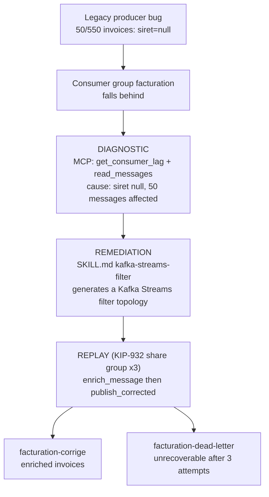
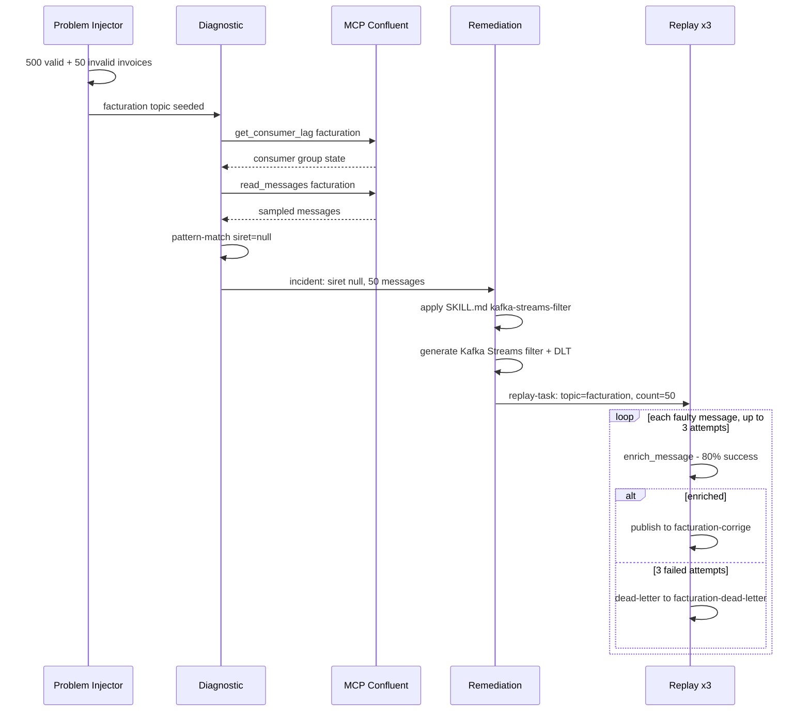
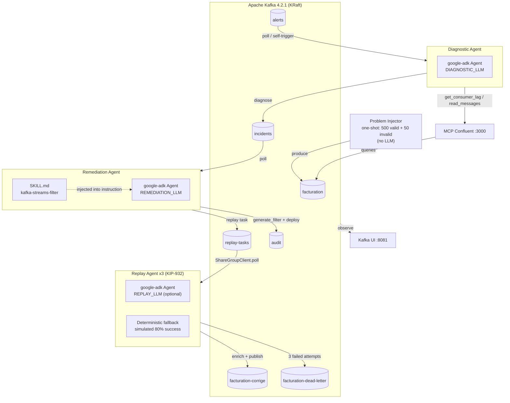

# Kafka Agentic Ops — Kafka as an Agent-Native Platform

[](https://kafka.apache.org/)
[](https://www.python.org/)
[](https://pypi.org/project/google-adk/)
[](https://docs.docker.com/compose/)

A proof-of-concept demonstrating how **Apache Kafka can serve as a native platform for AI agents that operate Kafka itself** — three real [google-adk](https://pypi.org/project/google-adk/) agents, each free to run a different LLM provider, cooperating over Kafka topics to diagnose a broken consumer group, generate a code fix, and replay the affected messages. No human in the loop.

> Article: [Quand un agent IA diagnostique, corrige et rejoue votre Kafka — tout seul](https://kafblog.dolizone.com/blog/kafka-plateforme-agent-native/)

This is the second PoC in the series. The [first PoC](https://github.com/arabaaoui/kafka-for-agents) used Kafka as **coordination infrastructure** for business agents (retail replenishment). This one flips the target: Kafka is the **thing being operated on** — the agents diagnose and repair Kafka itself. MCP stops being an auxiliary tool and becomes the primary interface; Agent Skills generate Kafka code instead of business rules; KIP-932 does enrichment replay instead of homogeneous task distribution. The first PoC's companion article: [Kafka remplace vos middlewares — une supply chain de 200 magasins pilotée par 3 agents IA](https://kafblog.dolizone.com/blog/kafka-agents-supply-chain/).

---

## Use Case: Diagnose → Remediate → Replay

A legacy producer has a bug: some invoices published to the `facturation` topic are missing their `siret` (French company registration number). The `facturation` consumer group starts falling behind because downstream processing chokes on the malformed records. Nobody has time to babysit Kafka — so three agents handle it end to end.

### Business Flow



### Functional Walkthrough



**Key facts:**
1. The `problem-injector` seeds `facturation` with 500 valid + 50 invalid (siret=null) invoices, then exits.
2. The **Diagnostic Agent** queries Kafka through MCP Confluent — no custom API layer — to find the lag and sample the offending messages.
3. The **Remediation Agent** applies [`SKILL.md`](skills/kafka-streams-filter/SKILL.md) to generate a Kafka Streams `filter()` topology that isolates bad records into a dead-letter topic, logs it to `audit`, and schedules a replay task.
4. The **Replay Agent** (×3 replicas, KIP-932 share group) consumes `replay-tasks` cooperatively, tries to recover each missing `siret` (simulated 80% success rate, up to 3 attempts), and republishes corrected invoices to `facturation-corrige` — anything still broken after 3 attempts goes to `facturation-dead-letter`.

---

## Architecture



**Pipeline flow:**

1. **Problem Injector** → one-shot script, seeds `facturation` with 500 valid + 50 invalid (`siret=null`) invoices, then exits.
2. **Diagnostic Agent** → queries `get_consumer_lag` and `read_messages` via MCP Confluent, pattern-matches the faulty field, and publishes a structured diagnostic to `incidents` via its own `diagnose` tool.
3. **Remediation Agent** → reads `incidents`, applies the `SKILL.md` kafka-streams-filter procedure (injected into its instruction at startup), generates the Kafka Streams filter code, logs it to `audit`, and schedules a `replay-tasks` entry.
4. **Replay Agent ×3** → cooperative consumption of `replay-tasks` via KIP-932 Share Groups; enriches and republishes each faulty message, or dead-letters it after 3 failed attempts.

---

## Real ADK agents, one LLM provider per agent

Every agent (`diagnostic`, `remediation`, and `replay`) is a real `google.adk.Agent` run through a `google.adk.Runner` — never a hand-rolled HTTP call to a provider API. [`agents/common/adk_factory.py`](agents/common/adk_factory.py) builds the model for any of the three agents from **three independent env var blocks**, so each agent can use a different provider and model:

```python
def create_llm(provider: str, model: str, api_key: str):
    if provider == "openai":
        return LiteLlm(model=f"openai/{model}", api_key=api_key)
    if provider == "anthropic":
        return LiteLlm(model=f"anthropic/{model}", api_key=api_key)
    if provider == "gemini":
        return LiteLlm(model=f"gemini/{model}", api_key=api_key)
    raise ValueError(f"Unknown LLM provider: {provider}")
```

All three providers are routed through [LiteLLM](https://docs.litellm.ai/) — there's no provider-specific SDK wiring, no separate `AnthropicLlm`/`Claude` branch, and no OpenAI-only payload assumption baked into the code. **Zero `httpx.post()` calls to an LLM API anywhere in this repo.**

```env
# Diagnostic Agent — OPTIONAL
DIAGNOSTIC_LLM_PROVIDER=openai
DIAGNOSTIC_LLM_MODEL=gpt-4o
DIAGNOSTIC_LLM_API_KEY=          # empty = deterministic, no LLM call at all

# Remediation Agent — OPTIONAL
REMEDIATION_LLM_PROVIDER=anthropic
REMEDIATION_LLM_MODEL=claude-sonnet-4-20250514
REMEDIATION_LLM_API_KEY=         # empty = deterministic, no LLM call at all

# Replay Agent — OPTIONAL
REPLAY_LLM_PROVIDER=gemini
REPLAY_LLM_MODEL=gemini-2.5-pro
REPLAY_LLM_API_KEY=              # empty = deterministic, no LLM call at all
```

**All three agents are runnable with zero LLM keys.** Each one follows the same principle: if its `*_LLM_API_KEY` is empty, no `AdkAgentRunner` is ever instantiated — the agent falls back to a fixed, deterministic path instead of calling out to a provider:

- **Diagnostic without a key**: deterministic pattern-matching on the sampled messages (`siret is null`) still identifies the root cause and publishes the incident.
- **Remediation without a key**: the Kafka Streams filter is generated from a fixed template that mirrors the `SKILL.md` procedure exactly (topology, Serde, dead-letter branch, unit test skeleton).
- **Replay without a key**: fully deterministic enrichment — simulated 80% success rate (`ENRICHMENT_SUCCESS_RATE`), no LLM reasoning per message.

This keeps the demo runnable end-to-end without paying for any LLM provider, and you can enable qualification/reasoning selectively per agent by setting only the keys you want.

---

## The 3 Pillars

### 1. MCP Confluent — LLMs Query Kafka Natively

The [MCP Confluent](https://github.com/confluentinc/mcp-confluent) bridge exposes Kafka as a tool that LLMs can call directly (`consume-messages`, `list-topics`, `get-topic-config`, `get-consumer-group-lag`). The Diagnostic Agent calls it through its `get_consumer_lag` / `read_messages` ADK tools — no custom API layer, the agent talks the same Kafka protocol as everything else. This is the primary interface for this PoC, not an auxiliary one: the agent's whole job is to interrogate Kafka about itself.

### 2. Agent Skills — Kafka Code Generation via SKILL.md

The Remediation Agent's behavior is driven by a plain-text [`SKILL.md`](skills/kafka-streams-filter/SKILL.md) file — a declarative, 6-step specification for generating a Kafka Streams `filter()` topology, read **once at startup** and injected straight into the ADK agent's `instruction`:

- Identify the problematic field and filtering condition
- Build the `filter()`/`branch()` topology
- Configure the right Serde (String, Avro, JSON)
- Add dead-letter error handling
- Generate a local test docker-compose
- Validate with a `TopologyTestDriver` unit test

Unlike PoC 1's `SKILL.md` (business rules for supply chain), this skill generates **Kafka infrastructure code** — the agent is repairing the platform it runs on.

### 3. KIP-932 Share Groups — Cooperative Replay with Enrichment

Replay agents consume the `replay-tasks` topic using [KIP-932](https://cwiki.apache.org/confluence/display/KAFKA/KIP-932%3A+Queues+for+Kafka) share group semantics. [`share_group_client.py`](agents/common/share_group_client.py) (same emulator as PoC 1) wraps a standard `Consumer` with an application-layer emulation of the KIP-932 state machine — per-message locks, ACK/RENEW/RELEASE lifecycle, lock expiry, and dead-letter after max delivery attempts.

Unlike PoC 1, where share groups distributed **homogeneous** execution tasks, here each task carries a **batch of faulty messages to enrich** — the replay agent reads the source `facturation` topic, attempts enrichment per message (up to 3 tries), and routes each one to either `facturation-corrige` or `facturation-dead-letter` before acknowledging the task itself.

- **Cooperative consumption**: 3 replay-agent replicas share the `replay-group`, each task delivered to exactly one.
- **ACK-based delivery**: a task is only marked complete when the agent calls `acknowledge(ACK)`.
- **Auto-reassignment**: if a replica crashes mid-task, the lock expires (30s default) and the task becomes `AVAILABLE` again for another replica.
- **Linear scalability**: `docker compose -f docker-compose.app.yml up -d --scale replay-agent=5` — see [`scripts/demo-replay.sh`](scripts/demo-replay.sh).

---

## Quickstart

### Prerequisites

- Docker & Docker Compose v2
- LLM API keys are optional for all three agents — leave any `*_LLM_API_KEY` empty to run that agent on its deterministic fallback instead

### Setup

```bash
# 1. Clone the repository
git clone https://github.com/arabaaoui/kafka-ops-agents.git
cd kafka-ops-agents

# 2. Create your environment file
cp .env.example .env

# 3. Edit .env — set any/all of DIAGNOSTIC_LLM_API_KEY, REMEDIATION_LLM_API_KEY,
#    REPLAY_LLM_API_KEY (all optional; empty = deterministic fallback)
vim .env

# 4. Start the test Kafka cluster + app services
make test-stack
make app
```

Visit [Kafka UI](http://localhost:8081) to explore topics and messages in real time.

---

## Demo Scripts

### Demo — Diagnostic → Remediation → Replay

```bash
make demo-diag
# or directly:
./scripts/demo-diag.sh
```

Starts the test stack, seeds the `facturation` problem scenario, launches all three agents (replay scaled ×3), and prints the diagnostic, the generated filter, and the replay outcome.

### Demo — Replay Scaling (bonus)

```bash
make demo-replay
# or directly:
./scripts/demo-replay.sh
```

Scales `replay-agent` from 3 to 5 replicas and watches cooperative consumption of `replay-tasks` across all of them (KIP-932 Share Groups).

---

## Development & Testing

For local development, the stack is split into two independent Compose files sharing an external Docker network — a standalone test Kafka cluster (`docker-compose.test.yml`) and the application services (`docker-compose.app.yml`). This lets you restart the agents without tearing down (or losing data in) the Kafka broker, and vice versa.

| File | Contains | Kafka port |
|------|----------|------------|
| `docker-compose.test.yml` | Standalone Kafka 4.2.1 (KRaft, 1 broker) + topic init (`facturation`, `facturation-corrige`, `alerts`, `incidents`, `replay-tasks`, `audit`) + Kafka UI (`:8081`) + `kcat` one-shot topic summary | `9093` |
| `docker-compose.app.yml` | `mcp-confluent`, `problem-injector`, `diagnostic-agent`, `remediation-agent`, `replay-agent` ×3 (no Kafka) | — (connects to `kafka:9093`) |

Both files attach to a shared external network, `kafka-ops-agents-test`, so the app services resolve the test broker by its service name (`kafka`).

### Makefile targets

```bash
make test-stack    # start the standalone test Kafka cluster (port 9093)
make app           # start the app services against the test cluster
make all           # test-stack + app in one go
make demo-diag     # full diagnostic → remediation → replay demo
make demo-replay   # replay scaling demo (bonus)
make logs          # follow app service logs
make logs-test     # follow Kafka test cluster logs
make check         # pipeline health: consumer groups, message counts, recent incidents/replay results
make monitor       # follow app agent logs + Kafka UI logs together
make topics        # show topic/partition state via docker exec
make local-test    # run the local Python deterministic-flow test, no Docker/LLM required
make stop-app      # stop the app services
make stop-test     # stop the test Kafka cluster
make clean         # stop everything and remove the test Kafka volume
make clean-all     # clean + remove the shared kafka-ops-agents-test network
```

### Monitoring the pipeline

Kafka UI (`http://localhost:8081`) gives you real-time visibility into topics, messages, and consumer groups. For command-line checks:

```bash
make check     # consumer groups state, message counts per topic, recent incidents/replay results
make logs      # live agent output: [DIAGNOSTIC], [REMEDIATION], [REPLAY]
make topics    # partition layout and replication for each topic
```

---

## Project Structure

```
kafka-ops-agents/
├── .env.example                      # Environment variable template (3 LLM blocks)
├── docker-compose.test.yml           # Standalone test Kafka cluster (port 9093)
├── docker-compose.app.yml            # App services only, connects to the test cluster
├── Makefile                          # Dev workflow targets (test-stack, app, local-test, ...)
├── SPEC.md                           # Full PoC specification
├── scripts/
│   ├── demo-diag.sh                  # Diagnostic → Remediation → Replay demo
│   └── demo-replay.sh                # Replay scaling demo (bonus)
├── skills/
│   └── kafka-streams-filter/
│       └── SKILL.md                  # Kafka Streams filter generation (Agent Skill) — Remediation Agent
├── mcp-confluent/
│   ├── Dockerfile
│   ├── package.json
│   └── server.js                     # MCP server exposing Kafka tools (KafkaJS)
├── tests/
│   └── test_deterministic_flow.py    # Local test of the deterministic flow, no Docker/LLM
└── agents/
    ├── Dockerfile.agent              # Shared image for the 3 agents + problem-injector
    ├── common/
    │   ├── config.py                 # Env-driven config, 3 LLM blocks
    │   ├── adk_factory.py            # LiteLLM-backed google-adk Agent factory + runner
    │   ├── share_group_client.py     # KIP-932 emulator (ACK/RENEW/RELEASE, dead-letter)
    │   └── requirements.txt
    ├── problem_injector/
    │   └── app.py                    # One-shot seeding of the facturation problem scenario
    ├── diagnostic/
    │   ├── agent.py                  # MCP tools (get_consumer_lag, read_messages) + diagnose tool
    │   └── prompts.py
    ├── remediation/
    │   ├── agent.py                  # SKILL.md-driven filter generation + deploy_filter tool
    │   └── prompts.py
    └── replay/
        ├── agent.py                  # ShareGroupClient consumer + enrich/publish tools
        └── prompts.py
```

---

## Configuration Reference

| Variable | Required | Default | Description |
|----------|----------|---------|-------------|
| `DIAGNOSTIC_LLM_PROVIDER` | No | `openai` | `openai` \| `anthropic` \| `gemini` |
| `DIAGNOSTIC_LLM_MODEL` | No | `gpt-4o` | Model name |
| `DIAGNOSTIC_LLM_API_KEY` | No | *(empty)* | Leave empty for deterministic diagnosis (pattern-matching on siret=null) |
| `REMEDIATION_LLM_PROVIDER` | No | `anthropic` | `openai` \| `anthropic` \| `gemini` |
| `REMEDIATION_LLM_MODEL` | No | `claude-sonnet-4-20250514` | Model name |
| `REMEDIATION_LLM_API_KEY` | No | *(empty)* | Leave empty for deterministic filter generation (template) |
| `REPLAY_LLM_PROVIDER` | No | *(empty)* | `openai` \| `anthropic` \| `gemini` |
| `REPLAY_LLM_MODEL` | No | *(empty)* | Model name |
| `REPLAY_LLM_API_KEY` | No | *(empty)* | Leave empty for deterministic enrichment (simulated 80% success) |
| `KAFKA_BOOTSTRAP_SERVERS` | No | `kafka:9092` | Kafka broker address |
| `MCP_CONFLUENT_URL` | No | `http://mcp-confluent:3000` | MCP Confluent HTTP endpoint |
| `SHARE_GROUP_LOCK_DURATION_MS` | No | `30000` | KIP-932 lock duration before a task is redelivered |
| `SHARE_GROUP_MAX_DELIVERY_ATTEMPTS` | No | `5` | Attempts before a replay task is dead-lettered |
| `ENRICHMENT_SUCCESS_RATE` | No | `0.8` | Simulated success rate when the replay agent tries to recover a missing siret |

---

## Requirements

- **Docker** 24+ (with Docker Compose v2)
- **Python 3.11** (for local development; not required for Docker-only usage)
- **LLM API keys are entirely optional** — the full pipeline runs deterministic with zero keys configured
- **~2 GB RAM** available for the full stack

---

## License

MIT
