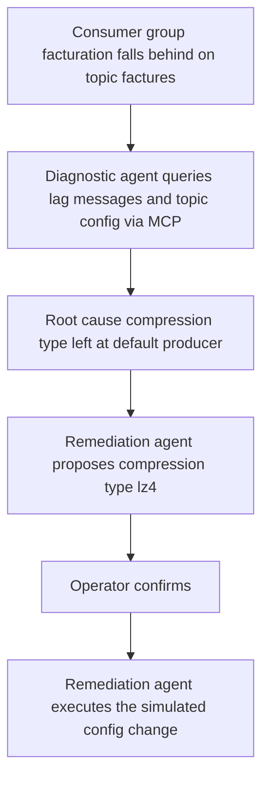
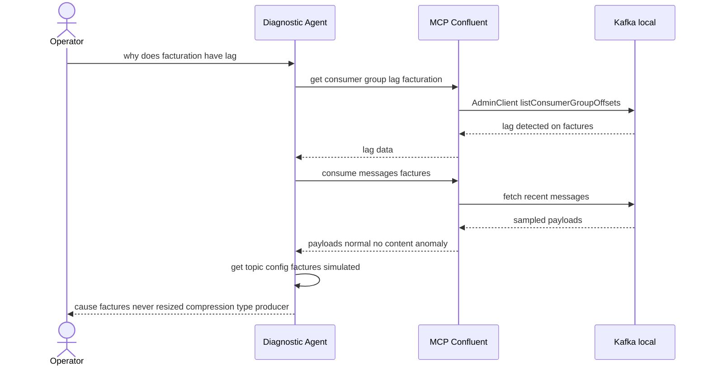
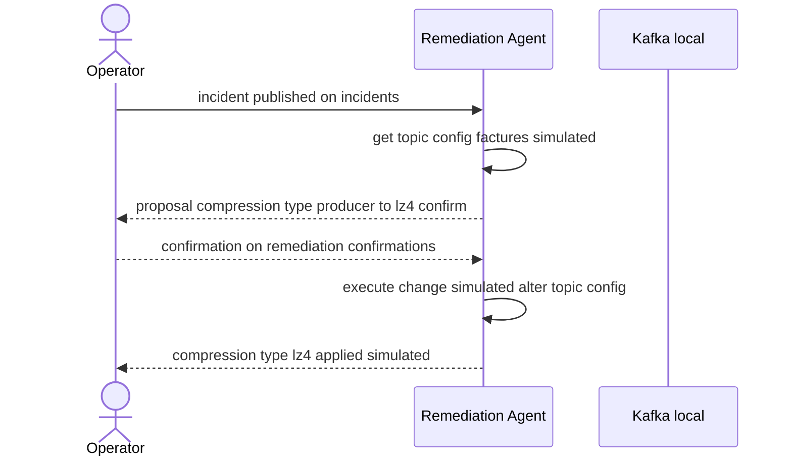
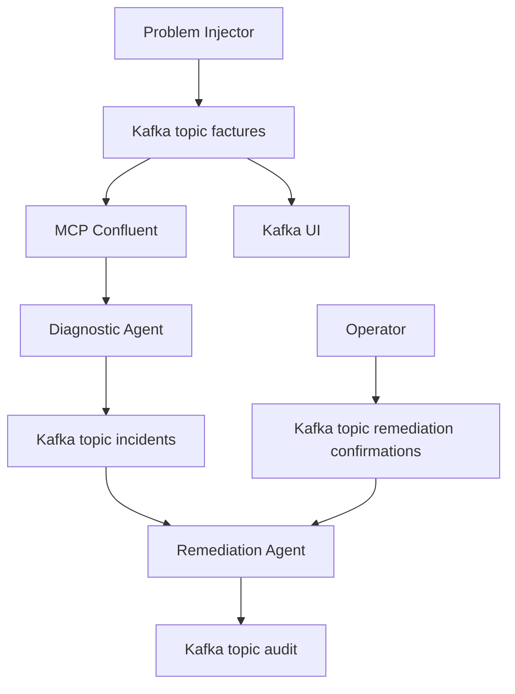

# Kafka Agentic Ops — Kafka Control Plane, Agent-Native

[](https://kafka.apache.org/)
[](https://www.python.org/)
[](https://pypi.org/project/google-adk/)
[](https://docs.docker.com/compose/)

A proof-of-concept demonstrating agents operating on the Kafka **control plane** — two real [google-adk](https://pypi.org/project/google-adk/) agents, each free to run a different LLM provider, diagnosing a lagging consumer group via MCP (read-only) and proposing a topic configuration fix that only gets applied after an explicit human confirmation.

> Article: [Quand un agent IA diagnostique votre Kafka — et qu'un second la corrige, avec votre accord](https://kafblog.dolizone.com/blog/kafka-agents-ops-loop/)

This is the second PoC in the series. The [first PoC](https://github.com/arabaaoui/kafka-for-agents) used Kafka as **coordination infrastructure** for business agents (retail replenishment). This one flips the target: Kafka is the **thing being operated on** — the agents diagnose and correct Kafka's own configuration. MCP is the primary interface for both reads and (simulated) writes; there is no code generation and no message replay in this PoC. Companion article for PoC 1: [Kafka remplace vos middlewares — une supply chain de 200 magasins pilotée par 3 agents IA](https://kafblog.dolizone.com/blog/kafka-agents-supply-chain/).

---

## Use Case: Diagnose → Propose → Confirm → Execute

A month-end billing run pushes the `factures` topic to a heavy write rate. The `facturation` consumer group falls behind — 1452 messages of lag. Nobody has time to open three dashboards to figure out why, so two agents handle the diagnosis and the fix, with a human confirming the one step that actually changes the cluster.

### Business Flow



### Functional Walkthrough — Diagnostic



### Functional Walkthrough — Remediation



**Key facts:**
1. The `problem-injector` produces a burst of invoice messages into `factures` and has the `facturation` consumer group commit only part of them, deliberately leaving a lag of 1452 messages — then exits.
2. The **Diagnostic Agent** queries Kafka through MCP Confluent (`get_consumer_lag`, `read_messages`, real calls) to confirm the lag and rule out a content problem, then inspects the topic's configuration (`get_topic_config`, simulated) and publishes a structured diagnostic to `incidents`.
3. The **Remediation Agent** reads `incidents`, re-reads the topic config, and *proposes* changing `compression.type` from `producer` to `lz4` — logged and published to `audit` as `pending_confirmation`. It does not execute anything yet.
4. An operator confirms (or cancels) via a message on `remediation-confirmations`, consumed through a native KIP-932 `ShareConsumer` so a confirmation is acted on exactly once, even if the agent crashes mid-flight. Only on `confirm: true` does the agent *execute* the change — logged as `SIMULATED: alter-topic-config(...)`, since the real MCP tool requires a Confluent Cloud endpoint unavailable on this local cluster.

---

## Architecture



**Pipeline flow:**

1. **Problem Injector** → one-shot script, produces the billing spike on `factures` and manufactures 1452 messages of lag on the `facturation` consumer group, then exits.
2. **Diagnostic Agent** → real MCP calls (`get_consumer_lag`, `read_messages`) plus a simulated `get_topic_config`, reasons over the results with its `diagnose` tool, and publishes the incident to `incidents`.
3. **Remediation Agent** → two phases driven by two different channels: *propose* on `incidents` (regular consumer group), *execute* on `remediation-confirmations` (KIP-932 share group). `execute_change` refuses to run unless a matching proposal is pending — the confirmation gate is enforced in code, not only in the prompt.

---

## Real ADK agents, one LLM provider per agent

Both agents (`diagnostic`, `remediation`) are real `google.adk.Agent` instances run through a `google.adk.Runner` — never a hand-rolled HTTP call to a provider API. [`agents/common/adk_factory.py`](agents/common/adk_factory.py) builds the model for either agent from **two independent env var blocks**, so each agent can use a different provider and model:

```python
def create_llm(provider: str, model: str, api_key: str):
    if provider == "openai":
        return LiteLlm(model=f"openai/{model}", api_key=api_key)
    if provider == "anthropic":
        return LiteLlm(model=f"anthropic/{model}", api_key=api_key)
    if provider == "gemini":
        return LiteLlm(model=f"gemini/{model}", api_key=api_key)
    raise ValueError(f"Unknown LLM provider: {provider}")
```

Both providers are routed through [LiteLLM](https://docs.litellm.ai/) — there's no provider-specific SDK wiring, no separate `AnthropicLlm`/`Claude` branch, and no OpenAI-only payload assumption baked into the code. **Zero `httpx.post()` calls to an LLM API anywhere in this repo** (MCP calls are plain JSON-RPC over HTTP, not LLM calls).

```env
# Diagnostic Agent — OPTIONAL
DIAGNOSTIC_LLM_PROVIDER=openai
DIAGNOSTIC_LLM_MODEL=gpt-4o
DIAGNOSTIC_LLM_API_KEY=          # empty = deterministic, no LLM call at all

# Remediation Agent — OPTIONAL
REMEDIATION_LLM_PROVIDER=anthropic
REMEDIATION_LLM_MODEL=claude-sonnet-4-20250514
REMEDIATION_LLM_API_KEY=         # empty = deterministic, no LLM call at all
```

**Both agents are runnable with zero LLM keys.** If an agent's `*_LLM_API_KEY` is empty, no `AdkAgentRunner` is ever instantiated — the agent falls back to a fixed, deterministic path:

- **Diagnostic without a key**: deterministic analysis of the topic config (`compression.type == "producer"`) still identifies the root cause and publishes the incident.
- **Remediation without a key**: the proposal and the execution both go through fixed logic that reads `recommended_config` from the incident — same outcome, no LLM reasoning.

This keeps the demo runnable end-to-end without paying for any LLM provider, and you can enable reasoning selectively per agent by setting only the keys you want.

---

## The 2 Pillars

### 1. MCP Confluent — Real Reads, Simulated Writes

The [MCP Confluent](https://github.com/confluentinc/mcp-confluent) bridge exposes Kafka as a tool LLMs can call directly. Against a local `bootstrap_servers` connection, only a subset of tools is real: `consume-messages`, `list-topics`, `get-consumer-group-lag`, and friends. `get-topic-config` and `alter-topic-config` only activate behind an authenticated `kafka.rest_endpoint` — in practice, a Confluent Cloud cluster.

This PoC respects that boundary instead of hiding it: `get_consumer_lag` and `read_messages` (Diagnostic Agent) are real MCP calls against the local Kafka. `get_topic_config` (both agents) and `execute_change`/`alter-topic-config` (Remediation Agent) are **simulated** in [`agents/common/simulated_control_plane.py`](agents/common/simulated_control_plane.py) — every simulated call is logged explicitly (`SIMULATED: alter-topic-config(...)`) so it's never mistaken for a real broker write.

### 2. KIP-932 Share Groups — A Safe Confirmation Channel

The Remediation Agent consumes `remediation-confirmations` using a native KIP-932 `ShareConsumer` ([`share_group_client.py`](agents/common/share_group_client.py), same wrapper as PoC 1, now backed by `confluent-kafka`'s native `ShareConsumer` instead of an application-level emulation). A human confirmation is a control-plane decision worth not losing: with explicit acknowledgement, a confirmation is only considered handled once the agent has actually acted on it, and gets redelivered automatically if the agent crashes mid-execution instead of silently vanishing.

Unlike PoC 1, where share groups distributed **homogeneous execution tasks** across replicas, here the share group protects a **single, high-stakes decision channel** — the gate between "the agent proposed a change" and "the agent wrote to the cluster."

---

## Quickstart

### Prerequisites

- Docker & Docker Compose v2
- LLM API keys are optional for both agents — leave any `*_LLM_API_KEY` empty to run that agent on its deterministic fallback instead

### Setup

```bash
# 1. Clone the repository
git clone https://github.com/arabaaoui/kafka-ops-agents.git
cd kafka-ops-agents

# 2. Create your environment file
cp .env.example .env

# 3. Edit .env — set DIAGNOSTIC_LLM_API_KEY and/or REMEDIATION_LLM_API_KEY
#    (both optional; empty = deterministic fallback)
vim .env

# 4. Start the test Kafka cluster + app services
make test-stack
make app
```

Visit [Kafka UI](http://localhost:8081) to explore topics and messages in real time.

---

## Demo Script

```bash
make demo-diag
# or directly:
./scripts/demo-diag.sh
```

Starts the test stack, injects the billing-spike lag scenario, launches both agents, and prints the diagnostic and the pending proposal. The demo then stops and waits — remediation does not execute on its own.

Confirm it explicitly:

```bash
make confirm
# or directly:
./scripts/confirm-remediation.sh
```

This finds the latest pending proposal on `audit` and produces a confirmation message to `remediation-confirmations`. Watch it get applied:

```bash
docker compose -f docker-compose.app.yml logs -f remediation-agent
```

---

## Development & Testing

For local development, the stack is split into two independent Compose files sharing an external Docker network — a standalone test Kafka cluster (`docker-compose.test.yml`) and the application services (`docker-compose.app.yml`). This lets you restart the agents without tearing down (or losing data in) the Kafka broker, and vice versa.

| File | Contains | Kafka port |
|------|----------|------------|
| `docker-compose.test.yml` | Standalone Kafka 4.2.x (KRaft, 1 broker, KIP-932 enabled) + topic init (`factures`, `alerts`, `incidents`, `remediation-confirmations`, `audit`) + Kafka UI (`:8081`) + `kcat` one-shot topic summary | `9093` |
| `docker-compose.app.yml` | `mcp-confluent`, `problem-injector`, `diagnostic-agent`, `remediation-agent` (no Kafka) | — (connects to `kafka:9093`) |

Both files attach to a shared external network, `kafka-ops-agents-test`, so the app services resolve the test broker by its service name (`kafka`).

### Makefile targets

```bash
make test-stack    # start the standalone test Kafka cluster (port 9093)
make app           # start the app services against the test cluster
make all           # test-stack + app in one go
make demo-diag     # diagnostic + pending remediation proposal demo
make confirm       # confirm the latest pending remediation proposal
make logs          # follow app service logs
make logs-test     # follow Kafka test cluster logs
make check         # pipeline health: consumer groups, message counts, recent activity
make monitor       # follow app agent logs + Kafka UI logs together
make topics        # show topic/partition state via docker exec
make local-test    # run the local Python deterministic-flow test, no Docker/LLM required
make stop-app      # stop the app services
make stop-test     # stop the test Kafka cluster
make clean         # stop everything and remove the test Kafka volume
make clean-all     # clean + remove the shared kafka-ops-agents-test network
```

### Monitoring the pipeline

Kafka UI (`http://localhost:8081`) gives you real-time visibility into topics, messages, and consumer groups. For command-line checks:

```bash
make check     # consumer groups state, message counts per topic, recent proposals/executions
make logs      # live agent output: [DIAGNOSTIC], [REMEDIATION]
make topics    # partition layout and replication for each topic
```

---

## Project Structure

```
kafka-ops-agents/
├── .env.example                      # Environment variable template (2 LLM blocks)
├── docker-compose.test.yml           # Standalone test Kafka cluster (port 9093, KIP-932 enabled)
├── docker-compose.app.yml            # App services only, connects to the test cluster
├── Makefile                          # Dev workflow targets (test-stack, app, local-test, ...)
├── SPEC.md                           # Full PoC specification
├── scripts/
│   ├── demo-diag.sh                  # Diagnostic + pending remediation proposal demo
│   └── confirm-remediation.sh        # Sends a human confirmation for the latest pending proposal
├── mcp-confluent/
│   ├── Dockerfile
│   ├── package.json
│   └── server.js                     # MCP server exposing Kafka tools (KafkaJS)
├── tests/
│   └── test_deterministic_flow.py    # Local test of the deterministic flow, no Docker/LLM
└── agents/
    ├── Dockerfile.agent              # Shared image for both agents + problem-injector
    ├── common/
    │   ├── config.py                 # Env-driven config, 2 LLM blocks
    │   ├── adk_factory.py            # LiteLLM-backed google-adk Agent factory + runner
    │   ├── share_group_client.py     # Native KIP-932 ShareConsumer wrapper
    │   ├── simulated_control_plane.py # SIMULATED get-topic-config / alter-topic-config
    │   └── requirements.txt
    ├── problem_injector/
    │   └── app.py                    # One-shot seeding of the billing-spike lag scenario
    ├── diagnostic/
    │   ├── agent.py                  # MCP tools (get_consumer_lag, read_messages) + diagnose tool
    │   └── prompts.py
    └── remediation/
        ├── agent.py                  # propose_change / execute_change, gated on confirmation
        └── prompts.py
```

---

## Configuration Reference

| Variable | Required | Default | Description |
|----------|----------|---------|-------------|
| `DIAGNOSTIC_LLM_PROVIDER` | No | `openai` | `openai` \| `anthropic` \| `gemini` |
| `DIAGNOSTIC_LLM_MODEL` | No | `gpt-4o` | Model name |
| `DIAGNOSTIC_LLM_API_KEY` | No | *(empty)* | Leave empty for deterministic diagnosis (compression.type check) |
| `REMEDIATION_LLM_PROVIDER` | No | `anthropic` | `openai` \| `anthropic` \| `gemini` |
| `REMEDIATION_LLM_MODEL` | No | `claude-sonnet-4-20250514` | Model name |
| `REMEDIATION_LLM_API_KEY` | No | *(empty)* | Leave empty for deterministic propose/execute |
| `KAFKA_BOOTSTRAP_SERVERS` | No | `kafka:9092` | Kafka broker address |
| `MCP_CONFLUENT_URL` | No | `http://mcp-confluent:3000` | MCP Confluent HTTP endpoint |
| `SHARE_GROUP_LOCK_DURATION_MS` | No | `30000` | KIP-932 lock duration before a confirmation is redelivered |
| `SHARE_GROUP_DELIVERY_COUNT_LIMIT` | No | `5` | Delivery attempts before a confirmation is dropped |

---

## Requirements

- **Docker** 24+ (with Docker Compose v2)
- **Python 3.11** (for local development; not required for Docker-only usage)
- **LLM API keys are entirely optional** — the full pipeline runs deterministic with zero keys configured
- **~2 GB RAM** available for the full stack

---

## License

MIT
